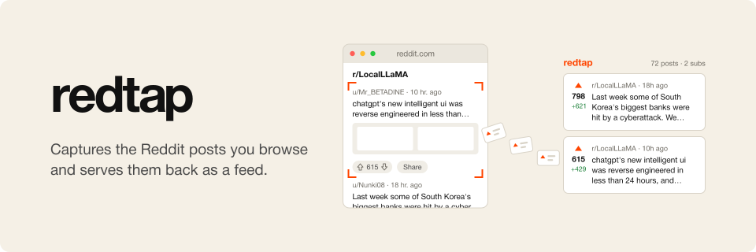
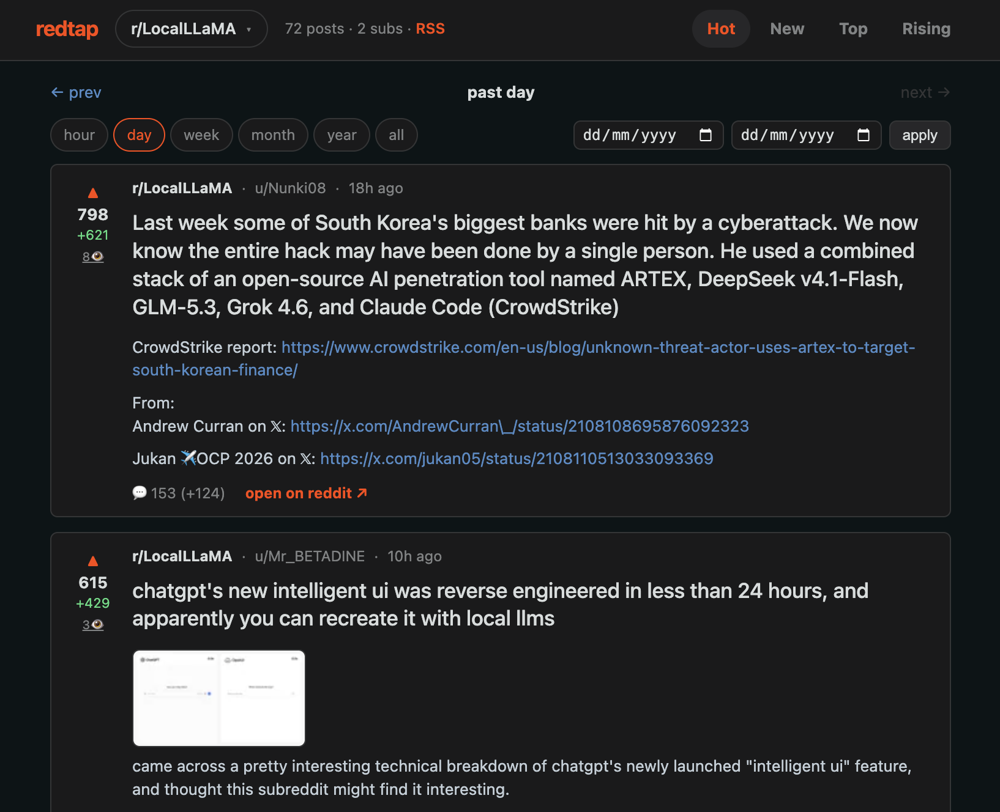

# redtap

<p align="center">
  
</p>

redtap is a passive Reddit scraper: a browser extension that archives the
Reddit posts you see while browsing. It captures each post from the page
itself, syncs them to a private Hugging Face bucket, and serves the archive
as a browsable feed — the same pipeline
[xTap](https://github.com/mkubicek/xTap) runs for X.



## What it does

- A content script watches Reddit's server-rendered `shreddit-post` web
  components (the feed and every page that shows posts) and captures the full
  post payload: id, title, author, subreddit, score, comment count,
  upvote ratio, timestamps, permalink, post type, and link metadata.
- Captures are normalized to a JSONL-friendly record (transport fields mirror
  xTap: `captured_at`, `pooled_at`, `contributed_by`, `source_endpoint`,
  `observation_id`, `metrics`), deduplicated by stable observation identity,
  and sampled when unchanged re-sightings arrive (5-minute gate).
- The popup shows capture counts and exports the unique-post JSONL via the
  downloads API (`redtap/redtap-<timestamp>.jsonl`).
- An `externally_connectable` bridge implements the same `xtap-scrape-v1`
  protocol the [Infinite Feed Scroller](https://github.com/osolmaz/infinite-feed-scroller)
  uses with xTap, so the scroller can drive Reddit scrape jobs with subreddit
  feeds playing the role of X lists.
- **Pool sync** writes to the private Hugging Face Bucket log
  `osolmaz/redtap-data` directly from the extension worker (no server):
  observations queue in the extension and one sealed, gzipped batch is
  committed per 2-hour cycle with idempotent fixed-path retries and
  Retry-After-aware backoff; on auth failure it shows a red badge and keeps a
  30-day local buffer. Configure the bucket + HF token in the extension
  options.

## Serving the site locally

The site is a plain Node server — no build step, nothing scheduled:

```
node builder/serve.mjs --backend hf        # read the private HF bucket
node builder/serve.mjs --backend local --dir ~/path/to/redtap-data
```

Both backends read the same segment layout; choosing one is a one-flag
change. `--backend hf` authenticates with `--token`, `$HF_TOKEN`, or
`~/.cache/huggingface/token`, in that order, and never logs it. The server
renders every route on demand (browse grid, day pages, post pages, `rss.xml`)
and listens on `0.0.0.0:8088` by default (`--host`/`--port` to change), so it
is reachable from your Tailnet on this machine's Tailscale IP. Add `--base
/redtap` to serve under a subpath. Restart the server to pick up new data.

`builder/build-site.mjs` still pre-renders the same routes to a static
folder, and `.github/workflows/build-site.yml` publishes it to GitHub Pages —
manual trigger only, never scheduled.


## Why DOM capture

Reverse engineering (see `docs/REVERSE-ENGINEERING.md`): new Reddit
server-side renders every post as a `<shreddit-post>` web component with the
full payload in attributes, while the `.json` API answers 403 to non-browser
clients. Capturing the DOM inside the real browser is therefore both the most
reliable and the most polite path — the same conclusion xTap reached for X.

## Install (personal use)

1. `chrome://extensions` → Developer mode → **Load unpacked** → select
   `extension/`.
2. Browse Reddit. The popup shows capture counts; **Export JSONL** writes the
   unique-post file to your downloads directory.

## Status

Private, personal-use project. See `docs/REQUIREMENTS.md` for the original
requirements and `docs/REVERSE-ENGINEERING.md` for the Reddit recon.
